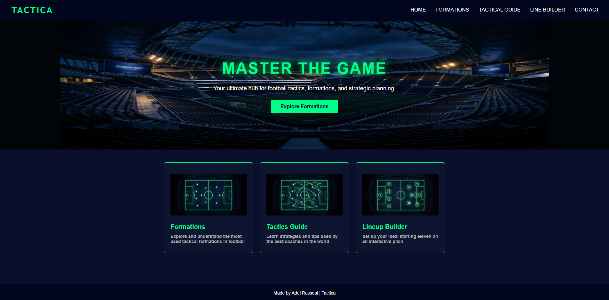
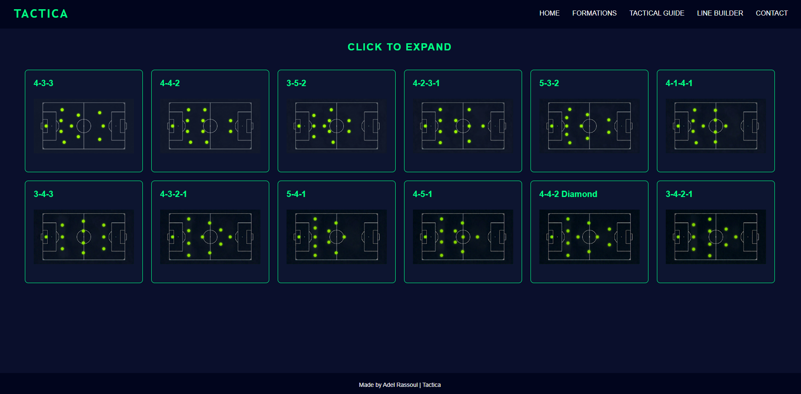
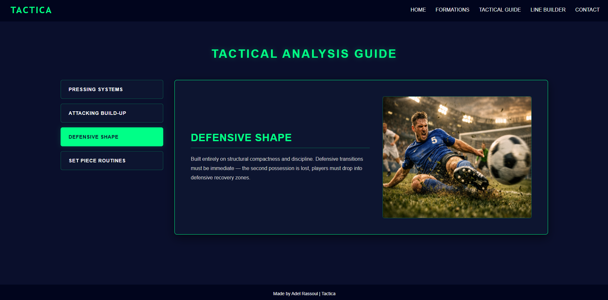
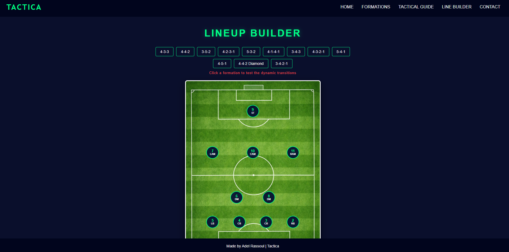
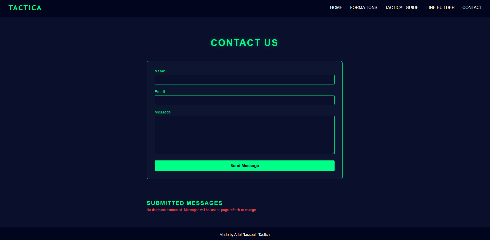

Tactica - Football Formations App

This is a frontend React web application built for football fans and amateur coaches to explore different tactical lineups, formations, and basic match strategies. 

The project is deployed and running live on Vercel at: 
https://tactica-two.vercel.app

---

## Features Built
Tactical Lineup Board: Users can switch between different classic formations to see how players are positioned on the pitch.
Formations Guide: A structured view that breaks down the pros, cons of famous tactical systems.
Strategy Guide: A simple playbook tab covering core football concepts like build-up play, pressing variants, and defensive structures.

---

## Tech Stack
Framework: React
Routing: React Router DOM
Styling: CSS
Hosting: Vercel

---

## How to Run Locally

If you want to clone this repository and run the development server on your machine, follow these steps:

 Clone the repository:

Bash:

git clone [https://github.com/AdelRassoul/Tactica.git](https://github.com/AdelRassoul/Tactica.git)

Open the project folder:

Bash:

cd tactica

Install the dependencies:

Bash:

npm install

Start the local server:

Bash:

npm start

The app should open automatically in your browser at http://localhost:3000.

## Screenshots

### Home

### Formations 

### Formations Expanded 

### Tactical Guide 

### LineUP Builder

### Contact

